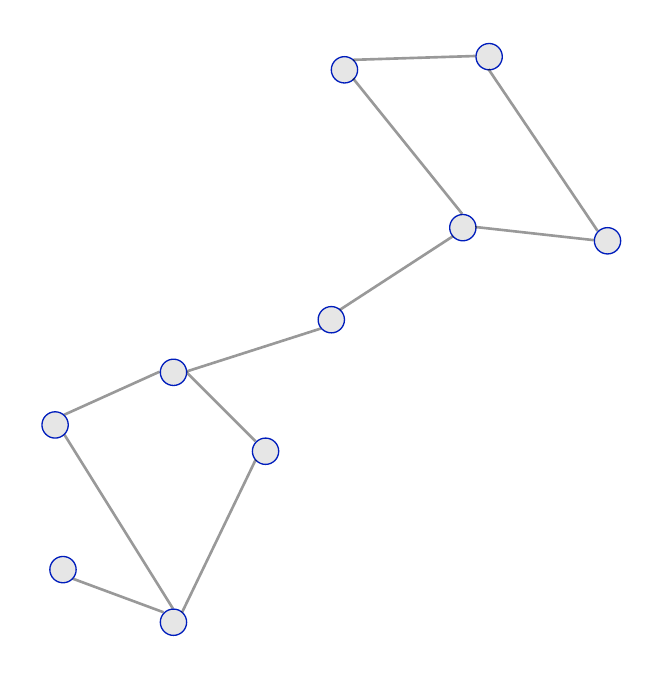
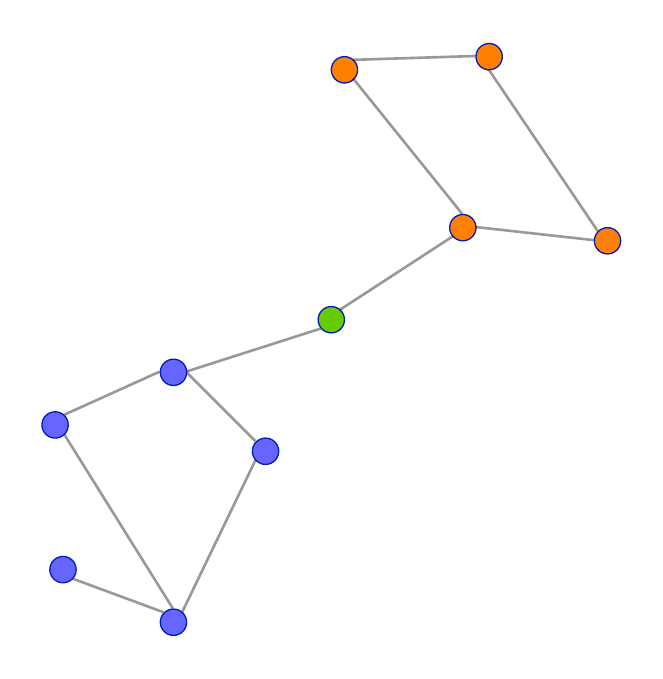
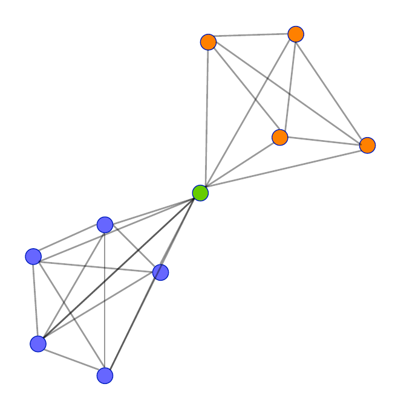
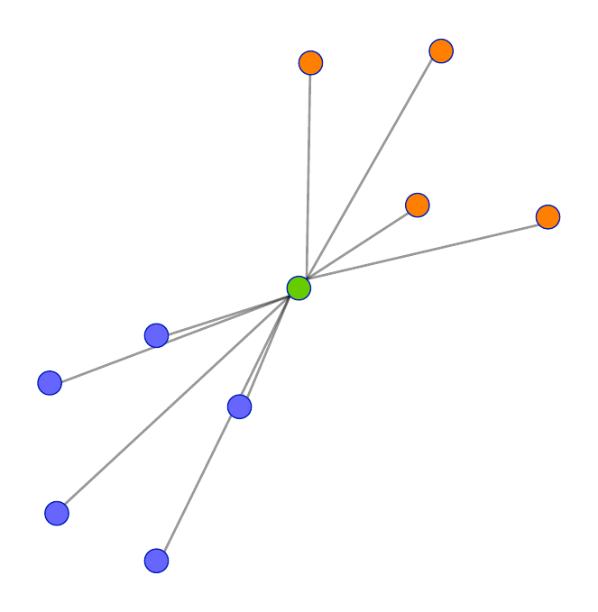

# Experimental Pipeline for Renormalized Graph Representations for Node Classification

This repository contains the code to reproduce the experimental pipeline described in our paper.

## File Overview

- **SpecificHeat.py** and **SpecificHeat.ipynb**  
  Calculate the characteristic scales using spectral entropy values.

- **DataGeneratorCharacteristic.py**  
  Preprocess graphs by aligning them to the characteristic scales.

- **new_train.py**  
  Run experiments on the preprocessed graphs.  
  (You can also refer to **run_cora_all_t_all_epochs** as an example.)

- **statistics_and_graph_generator_single_node.py**  
  Generate metrics, perform statistical tests, and produce the graphs discussed in the paper.

## Experimental Pipeline

The steps above complete the full experimental pipeline described in the paper.

# Visualization of the Rewiring Procedure

  
  
  
  

## Paper

The associated paper is available on [arXiv](https://arxiv.org/abs/2306.00707).

## License

This project is licensed under the [MIT License](LICENSE).
